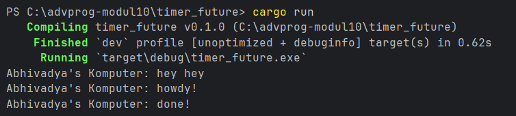
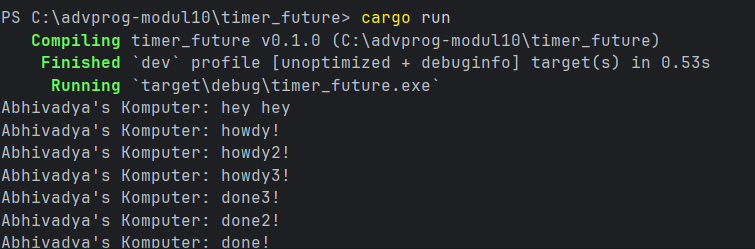
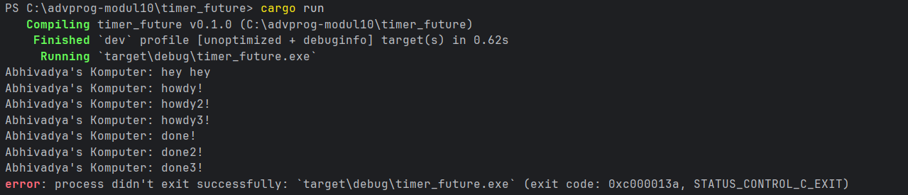
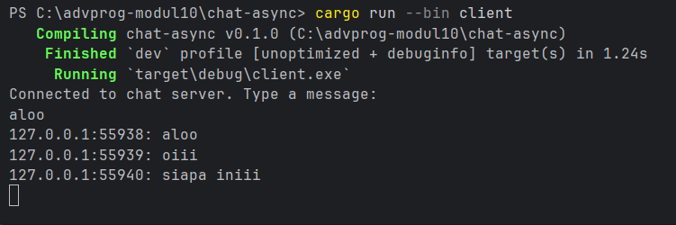
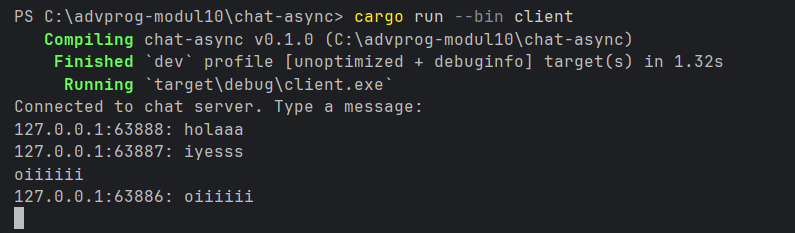

## Tutorial 1 - Timer

### Experiment 1.2: Understanding how it works

Pada eksperimen ini, saya menambahkan perintah `println!("Abhivadya's Komputer: hey hey");` setelah pemanggilan `spawner.spawn(...)`. Hasilnya, teks `hey hey` muncul lebih dulu dibandingkan `howdy!`. Hal ini terjadi karena `spawner.spawn(...)` hanya memasukkan task ke dalam queue, tetapi task tersebut belum langsung dijalankan. Task async baru mulai dijalankan ketika `executor.run()` dipanggil. Setelah executor berjalan, future di-poll dan mencetak `howdy!`, lalu menunggu `TimerFuture` selama dua detik. Setelah timer selesai, waker memberi tahu executor untuk melanjutkan task sehingga teks `done!` dicetak.

### Experiment 1.3: Multiple Spawn and removing drop

### Multiple Spawn

Pada eksperimen ini, saya menambahkan beberapa pemanggilan `spawner.spawn(...)`. Setiap pemanggilan `spawn` akan memasukkan satu task async ke dalam queue executor. Ketika `executor.run()` dipanggil, executor mulai mengambil task dari queue dan melakukan polling terhadap setiap future. Oleh karena itu, beberapa pesan `howdy` dapat muncul terlebih dahulu, lalu setelah timer selesai, masing-masing task dilanjutkan dan mencetak pesan `done`.

### Removing drop(spawner)

Pada eksperimen ini, saya mencoba menghapus `drop(spawner);`. Hasilnya, program tetap mencetak output dari task async, tetapi program tidak langsung selesai. Hal ini terjadi karena executor masih menunggu kemungkinan adanya task baru dari channel. `drop(spawner);` diperlukan untuk menutup sender utama, sehingga executor tahu bahwa tidak akan ada task baru lagi setelah semua task selesai dijalankan.

### Explanation

`Spawner` berfungsi untuk memasukkan task async ke dalam queue. `Executor` berfungsi untuk mengambil task dari queue dan menjalankannya sampai selesai dengan cara melakukan polling terhadap future. `drop(spawner);` digunakan untuk memberi tahu executor bahwa tidak ada lagi task baru yang akan dikirim. Hubungan ketiganya adalah spawner mengirim task, executor menjalankan task, dan drop menghentikan kemungkinan pengiriman task baru agar executor bisa berhenti ketika semua task selesai.

## Tutorial 2 - Broadcast Chat

### Experiment 2.1: Original code, and how it run

Pada eksperimen ini, saya menjalankan aplikasi broadcast chat asynchronous menggunakan websocket. Program terdiri dari satu server dan tiga client. Server dijalankan dengan perintah berikut:

\`\`\`bash
cargo run --bin server
\`\`\`

Client dijalankan dengan perintah berikut:

\`\`\`bash
cargo run --bin client
\`\`\`

Saya menjalankan satu server dan tiga client secara bersamaan. Setelah semua client terhubung ke server, saya mencoba mengetik pesan dari salah satu client. Pesan tersebut diterima oleh server, lalu server mengirimkan kembali pesan tersebut ke client-client lain yang sedang terhubung. Dengan begitu, pesan yang dikirim oleh satu client dapat terlihat pada client lainnya.

Aplikasi ini menunjukkan penggunaan asynchronous programming pada kasus yang lebih nyata. Server tidak hanya menangani satu client, tetapi dapat menangani beberapa client secara bersamaan. Penggunaan websocket memungkinkan komunikasi dua arah antara client dan server secara terus-menerus. Selain itu, penggunaan asynchronous runtime membantu server tetap responsif ketika menerima dan mengirim pesan dari beberapa koneksi.

### Experiment 2.2: Modifying the websocket port

Pada eksperimen ini, saya mengubah port websocket dari `2000` menjadi `8080`. Perubahan dilakukan pada sisi server dan sisi client karena websocket membutuhkan alamat koneksi yang sama antara server dan client. Pada sisi server, saya mengubah bagian `TcpListener::bind("127.0.0.1:2000")` menjadi `TcpListener::bind("127.0.0.1:8080")`. Perubahan ini membuat server mendengarkan koneksi websocket pada port `8080`.

Pada sisi client, saya mengubah URI websocket dari `ws://127.0.0.1:2000` menjadi `ws://127.0.0.1:8080`. Protocol websocket didefinisikan pada bagian URI client dengan prefix `ws://`. Setelah perubahan dilakukan, aplikasi tetap dapat berjalan dengan baik. Server dapat menerima koneksi dari beberapa client, dan pesan yang dikirim oleh salah satu client tetap dapat di-broadcast ke client lainnya.